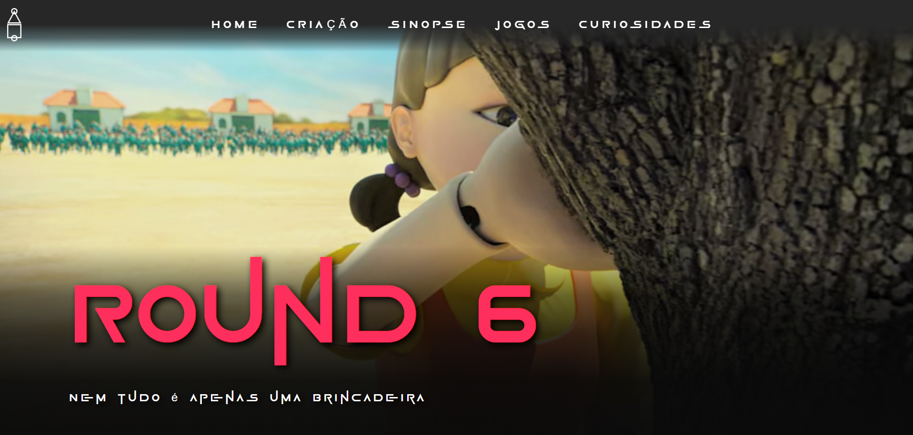
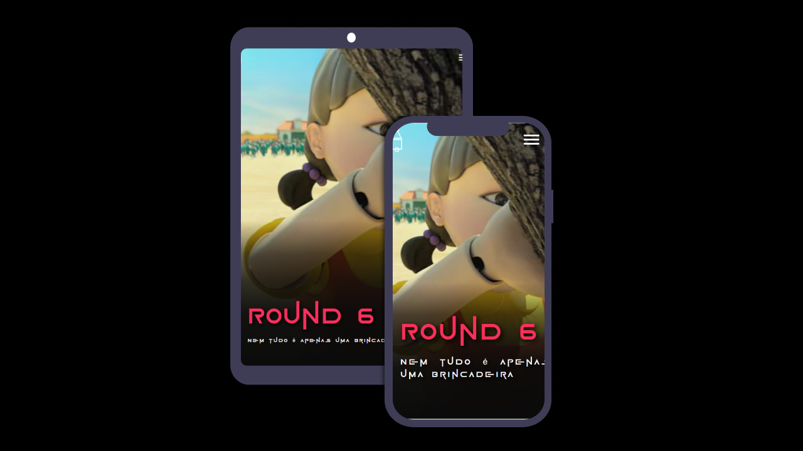

# Round 6

# 
 Round 6 

  

# About:
Round 6 application is a website to present all about this new series, that is so popular all over the world.

There was a lot of studying about this series to develop it with so many details. Since colors, animations till sounding effects.

Scrolling down website, there's things like: 
- how the series was developed;
-  what motivated to do that;
-  some curiosities about the game.

The main goal about doing it was created something from scratch and put into practice all knowlegde about Bootstrap, Sass, improving Javascript and API.

## Features:
- [x] Count visitors;
- [x] Creation, synopsis, games and curiosities;
- [x] Sounding effects;

## Responsive layout:

  

## Javascript Main Challenges:

- Structuring API;
- Improving callback functions;
- Understand object.entries();
- Get values from selectIndex() propriety;

## CSS Main Challenges:
- SVG Animations;
- Build stroke - dasharray and stroke-dashoffeset; 
- Keyframes.
  
## Skills:

